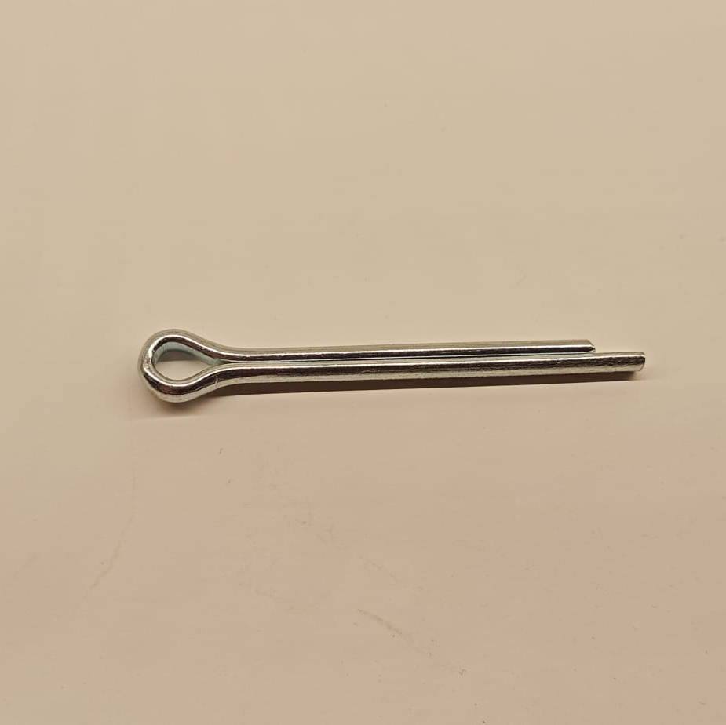
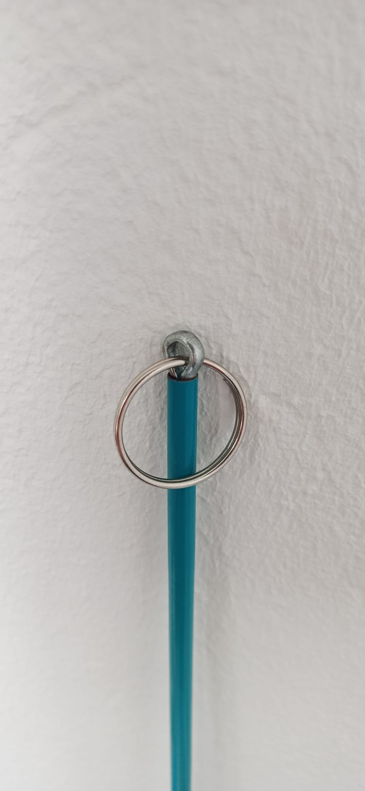
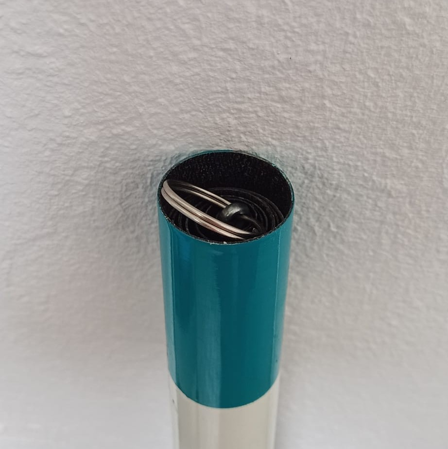
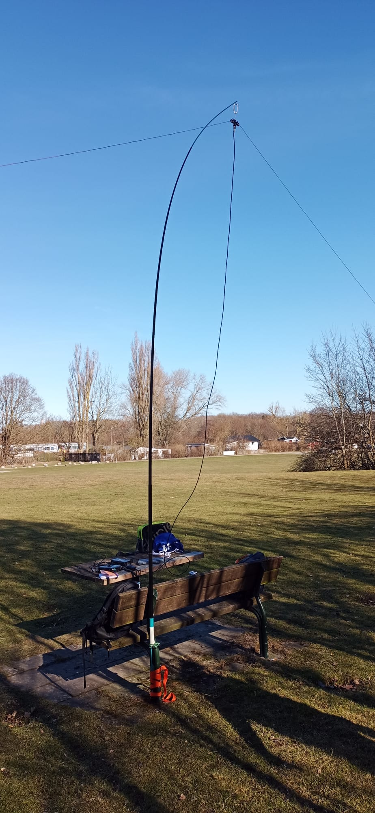
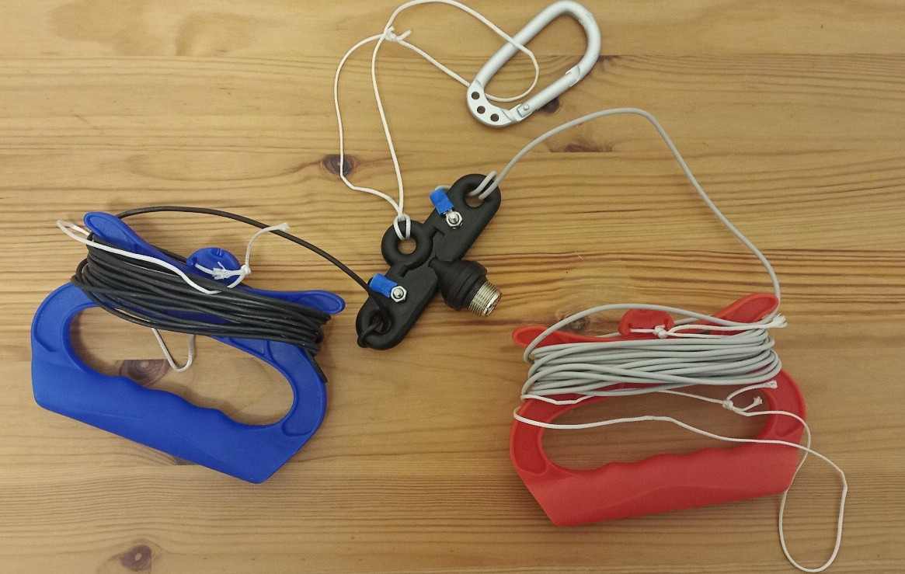

## Mat

Le mat que j'utilise est une canne à pêche en fibre de verre. Elle fait normalement 5m de long.

### Mise en place

Elle a été modifié pour pouvoir y accrocher une antenne. Le scion (dernier brin de la canne à pêche) a été retiré car trop fin et trop souple pour supporter une antenne. La longueur de la canne à pêche est donc d'environ 4,5m. Au sommet j'ai donc monté une goupille fendue et un anneau de clés.
La goupille est simplement enfilé dans le segment. Pour être sûr qu'elle ne bouge pas, elle est un peu courbée. Spiderbeam utilise la même solution pour ses mats en fibre de verre.

Ainsi elle est toujours démontable en tirant fort dessus. Si le système me convient au bout de quelques mois, elle sera collée.
L'avantage est que la canne à pêche rentre toujours parfaitement dans son étui avec le bouchon. Le montage permet de monter n'importe quoi avec un mousqueton. Il est par exemple possible de monter un V inversé ou une antenne filaire comme [celle-ci](https://www.f5kav.fr/wp-content/uploads/simple-file-list/F5RCT/Realisations/Antennes/AntenneDoubleJ.pdf).

 

### Fixations

Pour monter le mat à la verticale, j'utilise ce qui se trouve à proximité. En général c'est un banc ou une table de pique-nique. Dans le sac j'ai toujours des tendeurs de vélo, une sangle, des colliers de serrage et quelques sardines pour m'adapter à ce que je trouve. Si un support vertical est disponible, quelques tours de sangle autour de la canne à pêche suffisent à bien la maintenir. Parfois les banc sont légèrement inclinés. Combiner plusieurs tendeurs et sardines permet de fixer la canne à pêche au banc. Les tendeurs sur le banc permettent de bloquer la canne à pêche. Les sardines et tendeurs au sol la maintiennent à la verticale.

## Antenne

La première antenne que j'ai testé est un V inversé.
V inversé
dimensions

### Fixations

L'antenne est reliée au mat par un mousqueton. Elle est donc démontable et est rangée dans un sac en plastique pour le transport.

L’extrémité des fils conducteurs est reliée au sol par de la ficelle de cerf-volant. Sur internet, il est possible de trouver plusieurs système pour le bout du fil (isolateurs en plastique, pièces imprimées en 3D). Pour ma part j'ai fait un nœud avec la ficelle. La photo pour le réaliser est la suivante :

*photo*

Je l'ai fait un peu par hasard et lorsqu'une traction est exercée, il tient correctement.

Comme j'avais récupéré la ficelle sur un cerf-volant, j'utilise les poignées pour enrouler le tout. Une petite boucle passe autour d'une sardine pour tendre l'antenne et la maintenir en place.

